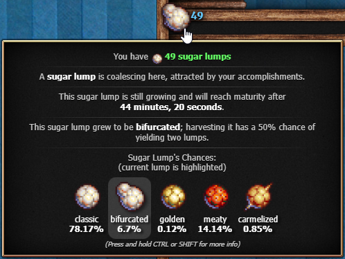

# Sugar Lump Info
This is a mod that removes all the useless information from the standard tooltip and allows you to view more important information instead as well as giving you additional information on a second page.  



## To Install:

### Bookmarklet

Copy this code and save it as a bookmark. Paste it in the URL section. To activate, click the bookmark when the game's open.

```javascript
javascript: (function () {
  Game.LoadMod('https://frustrated-programmer.github.io/SugarLumpInfo/SugarLumpInfo.js');
}());
```

If (for some reason) the above doesn't work, trying pasting everything after the <code>javascript:</code> bit into your browser's console.

### Userscript

If you'd rather use the addon as an [userscript](https://en.wikipedia.org/wiki/Userscript) to automatically load _Sugar Lump_ every time the original game loads, install the `SugarLumpInfo.user.js` file. You can do this by clicking on the file in the file-list and clicking "raw" to get the necessary code to copy over into your userscript.

### Steam

I don't OWN the Steam version, so I've just worked with the documentation. This should work with Steam version but I cannot test it myself. But I did receive someone who reached out to let me know it does work!
1. Download the `steam-mod` folder included in this repo.
2. Move the folders of the mods you want into `<yoursteaminstall>\SteamApps\common\Cookie Clicker\resources\app\mods\local`, you can get to this from the mods menu.
3. Enable them in-game with the mods menu.

## Files:
* `SugarLumpInfo.js` is just the source code.
* `SugarLumpInfo.main.js` is everything you need if you want to have the source code loading inside an extension.
* `SugarLumpInfo.user.js` is the recommended userscript you can use to load Sugar Lump Info and keep it up to date.

# Todo
This is a just passion project of mine. These are my ideas for how to improve. But without some donations or incredible recognition, I probably won't implement these. Feel free to make a PR I'll probably accept it.

* Add a setting that lets the user see ALL the upgrades on the 2nd list and how each upgrade individually reduces the time
* Add a setting to temp disable the mod, so users can compare between using and not using it.
* Possibly add a page in the stats, that let users see what the probabilities are for getting Sugar Lumps are depending on what auras/upgrades they use

# Check out my OTHER mod!

## <a href="https://github.com/Frustrated-Programmer/BuildingSorter">Building Sorter</a>
<a href="https://github.com/Frustrated-Programmer/BuildingSorter"></a>

## <a href="https://github.com/Frustrated-Programmer/ChartingMutations">Charting Mutations:</a>
<a href="https://github.com/Frustrated-Programmer/ChartingMutations"></a>
